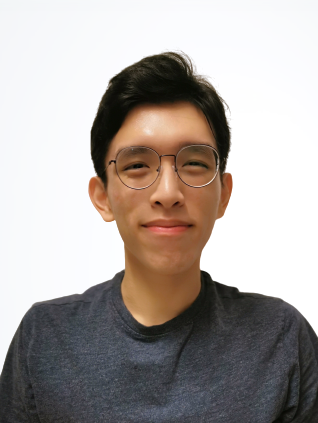
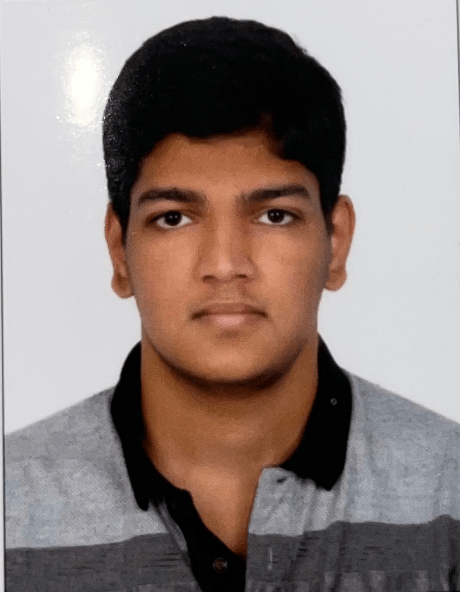
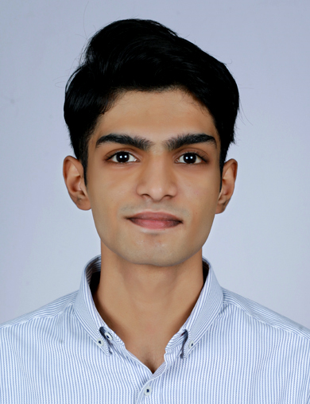
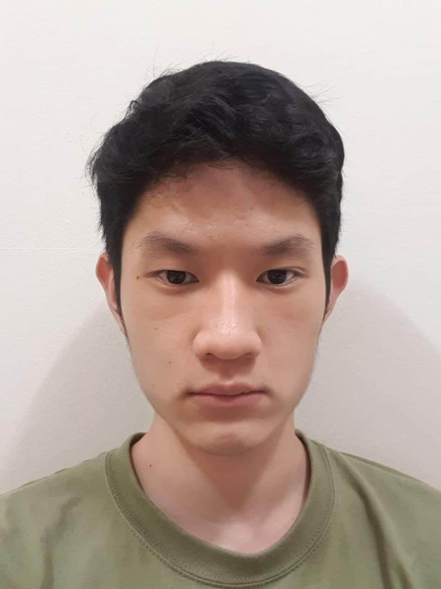

We are a team based in the [School of Computing, National University of Singapore](http://www.comp.nus.edu.sg).

You can reach us at the email `seer[at]comp.nus.edu.sg`

## Project team

### William Ming

[[github](http://github.com/cpwill01)]
[[portfolio](team/cpwill01.md)]

* Role: Team Lead, Developer
* Responsibilities: Documentation, UI

### Rahul Prasad

[[github](http://github.com/rahulprasad01)] [[portfolio](team/rahulprasad01.md)]

* Role: Developer
* Responsibilities: Testing, Deliverables and deadlines, in charge of parser

### Thomas Cherian

[[github](http://github.com/tomascherian)]
[[portfolio](team/tomascherian.md)]

* Role: Developer
* Responsibilities: Code Quality, in charge of Storage component

### Fong Yi Fei

[[github](http://github.com/yifei2)]
[[portfolio](team/yifei2.md)]

* Role: Developer
* Responsibilities: Integration, Scheduling and Tracking, in charge of Commands component
