* Table of Contents
{:toc}

--------------------------------------------------------------------------------------------------------------------

## **Acknowledgements**

* {list here sources of all reused/adapted ideas, code, documentation, and third-party libraries -- include links to the original source as well}

--------------------------------------------------------------------------------------------------------------------

## **Setting up, getting started**

Refer to the guide [_Setting up and getting started_](SettingUp.md).

--------------------------------------------------------------------------------------------------------------------

## **Design**

<div markdown="span" class="alert alert-primary">

:bulb: **Tip:** The `.puml` files used to create diagrams in this document can be found in the [diagrams](https://github.com/se-edu/addressbook-level3/tree/master/docs/diagrams/) folder. Refer to the [_PlantUML Tutorial_ at se-edu/guides](https://se-education.org/guides/tutorials/plantUml.html) to learn how to create and edit diagrams.
</div>

### Architecture


The ***Architecture Diagram*** given above explains the high-level design of the App.

Given below is a quick overview of main components and how they interact with each other.

**Main components of the architecture**

**`Main`** has two classes called [`Main`](https://github.com/se-edu/addressbook-level3/tree/master/src/main/java/seedu/address/Main.java) and [`MainApp`](https://github.com/se-edu/addressbook-level3/tree/master/src/main/java/seedu/address/MainApp.java). It is responsible for,
* At app launch: Initializes the components in the correct sequence, and connects them up with each other.
* At shut down: Shuts down the components and invokes cleanup methods where necessary.

[**`Commons`**](#common-classes) represents a collection of classes used by multiple other components.

The rest of the App consists of four components.

* [**`UI`**](#ui-component): The UI of the App.
* [**`Logic`**](#logic-component): The command executor.
* [**`Model`**](#model-component): Holds the data of the App in memory.
* [**`Storage`**](#storage-component): Reads data from, and writes data to, the hard disk.


**How the architecture components interact with each other**

The *Sequence Diagram* below shows how the components interact with each other for the scenario where the user issues the command `delete 1`.


Each of the four main components (also shown in the diagram above),

* defines its *API* in an `interface` with the same name as the Component.
* implements its functionality using a concrete `{Component Name}Manager` class (which follows the corresponding API `interface` mentioned in the previous point.

For example, the `Logic` component defines its API in the `Logic.java` interface and implements its functionality using the `LogicManager.java` class which follows the `Logic` interface. Other components interact with a given component through its interface rather than the concrete class (reason: to prevent outside component's being coupled to the implementation of a component), as illustrated in the (partial) class diagram below.


The sections below give more details of each component.

### UI component

The **API** of this component is specified in [`Ui.java`](https://github.com/AY2122S2-CS2103T-W12-3/tp/blob/master/src/main/java/seedu/address/ui/Ui.java)

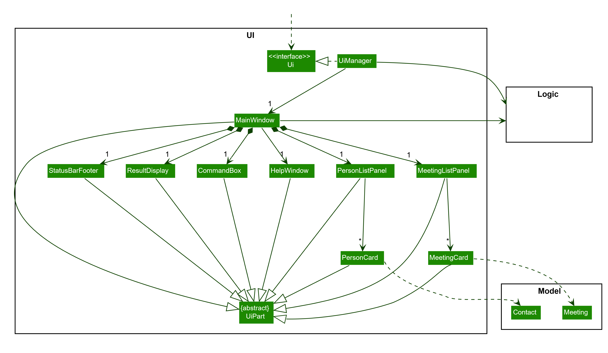

The UI consists of a `MainWindow` that is made up of parts e.g.`CommandBox`, `ResultDisplay`, `PersonListPanel`, `StatusBarFooter` etc. All these, including the `MainWindow`, inherit from the abstract `UiPart` class which captures the commonalities between classes that represent parts of the visible GUI.

The `UI` component uses the JavaFx UI framework. The layout of these UI parts are defined in matching `.fxml` files that are in the `src/main/resources/view` folder. For example, the layout of the [`MainWindow`](https://github.com/se-edu/addressbook-level3/tree/master/src/main/java/seedu/address/ui/MainWindow.java) is specified in [`MainWindow.fxml`](https://github.com/se-edu/addressbook-level3/tree/master/src/main/resources/view/MainWindow.fxml)

The `UI` component,

* executes user commands using the `Logic` component.
* listens for changes to `Model` data so that the UI can be updated with the modified data.
* keeps a reference to the `Logic` component, because the `UI` relies on the `Logic` to execute commands.
* depends on some classes in the `Model` component, as it displays `Contact` objects and `Meeting` objects residing in the `Model`.

### Logic component

**API** : [`Logic.java`](https://github.com/se-edu/addressbook-level3/tree/master/src/main/java/seedu/address/logic/Logic.java)

Here's a (partial) class diagram of the `Logic` component:


How the `Logic` component works:
1. When `Logic` is called upon to execute a command, it uses the `AddressBookParser` class to parse the user command.
1. This results in a `Command` object (more precisely, an object of one of its subclasses e.g., `AddCommand`) which is executed by the `LogicManager`.
1. The command can communicate with the `Model` when it is executed (e.g. to add a person).
1. The result of the command execution is encapsulated as a `CommandResult` object which is returned back from `Logic`.

The Sequence Diagram below illustrates the interactions within the `Logic` component for the `execute("deletec 1")` API call.


<div markdown="span" class="alert alert-info">:information_source: **Note:** The lifeline for `DeleteContactCommandParser` should end at the destroy marker (X) but due to a limitation of PlantUML, the lifeline reaches the end of diagram.
</div>

Here are the other classes in `Logic` (omitted from the class diagram above) that are used for parsing a user command:


How the parsing works:
* When called upon to parse a user command, the `AddressBookParser` class creates an `XYZCommandParser` (`XYZ` is a placeholder for the specific command name e.g., `AddCommandParser`) which uses the other classes shown above to parse the user command and create a `XYZCommand` object (e.g., `AddCommand`) which the `AddressBookParser` returns back as a `Command` object.
* All `XYZCommandParser` classes (e.g., `AddCommandParser`, `DeleteCommandParser`, ...) inherit from the `Parser` interface so that they can be treated similarly where possible e.g, during testing.

### Model component
**API** : [`Model.java`](https://github.com/AY2122S2-CS2103T-W12-3/tp/blob/master/src/main/java/seedu/address/model/Model.java)


The `Model` component,

* stores the address book data i.e., all `Contact` objects and all `Meeting` objects (which are contained in a `UniquePersonList` object and a `UniqueMeetingList` respectively).
* stores the currently 'selected' `Contact` objects (e.g., results of a search query) as a separate _filtered_ list which is exposed to outsiders as an unmodifiable `ObservableList<Contact>` that can be 'observed' e.g. the UI can be bound to this list so that the UI automatically updates when the data in the list change.
* stores the currently 'selected' `Meeting` objects (e.g., results of a search query) as a separate _filtered_ list which is exposed to outsiders as an unmodifiable `ObservableList<Meeting>` that can be 'observed' e.g. the UI can be bound to this list so that the UI automatically updates when the data in the list change.
* stores a `UserPref` object that represents the user’s preferences. This is exposed to the outside as a `ReadOnlyUserPref` objects.
* does not depend on any of the other three components (as the `Model` represents data entities of the domain, they should make sense on their own without depending on other components)

<div markdown="span" class="alert alert-info">:information_source: **Note:** An alternative (arguably, a more OOP) model is given below. It has two `Tag` lists in the `AddressBook`, which `Person` and `Meeting` references. This allows `AddressBook` to only require one `Tag` object per unique tag, instead of each `Person` and each `Meeting` needing their own `Tag` objects.<br><br>

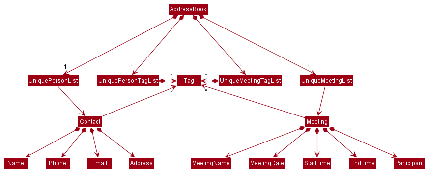

</div>


### Storage component

**API** : [`Storage.java`](https://github.com/AY2122S2-CS2103T-W12-3/tp/blob/master/src/main/java/seedu/address/storage/Storage.java)

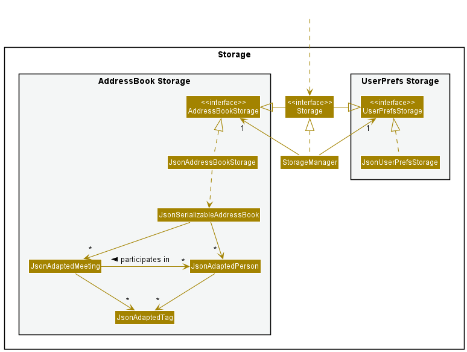

The `Storage` component,
* can save both address book data and user preference data in json format, and read them back into corresponding objects.
* inherits from both `AddressBookStorage` and `UserPrefStorage`, which means it can be treated as either one (if only the functionality of only one is needed).
* depends on some classes in the `Model` component (because the `Storage` component's job is to save/retrieve objects that belong to the `Model`)

### Common classes

Classes used by multiple components are in the `seedu.addressbook.commons` package.

--------------------------------------------------------------------------------------------------------------------

## **Implementation**

This section describes some noteworthy details on how certain features are implemented.

### Add Meeting feature

This section describes how a ```Meeting``` object is added to the list of meetings using the ```addm``` command.

#### Implementation

A ```Meeting``` object in AddresSoc consists of ```MeetingName```,```MeetingDate```,```StartTime```,```EndTime```,
as well as the optional ```Tags``` and ```Participants``` fields. Upon the ```addm``` command being called with the
relevant fields provided, a ```Meeting``` will be added to the ```UniqueMeetingList```.

Given below is an example usage scenario and how the ```addm``` command behaves at each step.
1. The user inputs the command ```addm mn/2103 Meeting d/25/03/2022 st/1600 et/1800 t/Important pt/2 pt/3```
2. The user input is passed into ```AddressBookParser``` which matches the ```addm``` command word and passes the arguments to ```AddMeetingCommandParser```.
3. ```AddMeetingCommandParser``` parses the arguments according to the prefixes and constructs a ```AddMeetingCommand``` object.
4. The ```AddMeetingCommand``` object is returned to ```LogicManager``` to be executed. During execution, the ```Meeting``` object with the given fields is constructed and added to the ```UniqueMeetingList```.

#### Sequence Diagram

The sequence diagram below shows the execution of the above example:


<div markdown="span" class="alert alert-info">:information_source: **Note:** The lifeline for `AddMeetingCommandParser` should end at the destroy marker (X) but due to a limitation of PlantUML, the lifeline reaches the end of diagram.
</div>
<div markdown="span" class="alert alert-info">:information_source: **Note:**The arguments for methods and constructors have been shortened for clarity in the diagram.
</div>

#### Activity Diagram

The activity diagram below shows the execution of the above example:

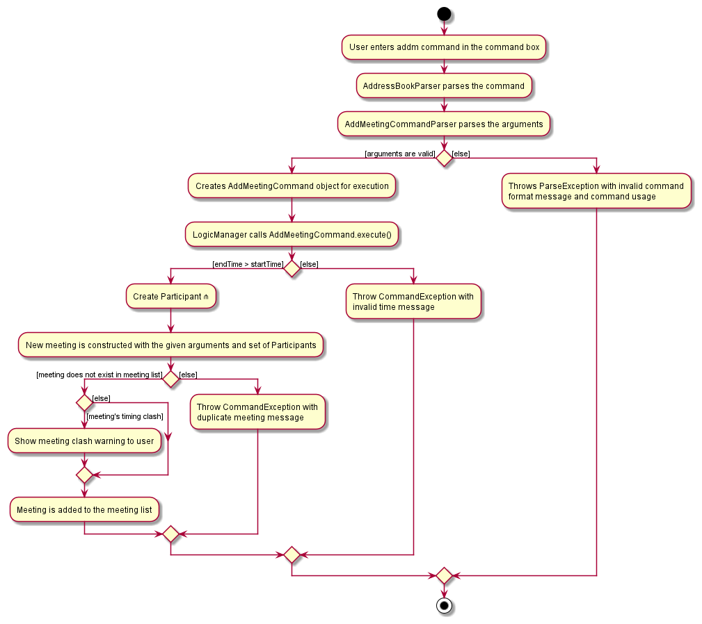

<div markdown="span" class="alert alert-info">:information_source: **Note:** The Create Participant ⋔ references the Create Participant
Activity Diagram in the Managing meeting participants section below.
</div>

#### Design Considerations

**Aspect: How `Participant` is constructed**

* **Alternative 1 (current choice):** `Participant` constructed using a `Contact`.
  * Pros: Better extensibility as it will be possible to implement features that can interact with the `Participant` in each meeting.
  * Cons: More difficult to implement as a `Participant` would need to change if changes are made to the corresponding `Contact`.
* **Alternative 2:** `Participant` constructed using a `String`.
  * Pros: `Participant` has less dependence on `Contact`. Better flexibility as each `Participant` no longer needs to be a `Contact`.
  * Cons: Less extensibility as `Participant` does not have any link to `Contact`. Changes to each `Contact` that is in a `Meeting` will require a separate command to change the `Participant` as well.

**Aspect: How to deal with clash in `Meeting` timings**

* **Alternative 1 (current choice):** A clash in timings will notify the user of the clash.
  * Pros: User is still allowed to add meetings regardless of the timing of other meetings in the list.
  * Cons: Clash in meetings are left in the meeting list until the user deals with it. May cause confusion for the user if not dealt with.
* **Alternative 2** A clash in timings will throw an exception.
  * Pros: Meetings that clash will not be added and will not cause confusion for the user. The user can edit or remove clashing meetings before attempting to add the meeting again.
  * Cons: Will require more steps to adding a meeting with time clash. User will have to edit or remove clashing meetings before adding again.

Reasons for choosing Alternative 1:

* Overall, it is more efficient for the user as the original meeting will be successfully added to the list. The implemented
notification pop-up should suffice in prompting the user to resolve any clashes in timings through editing or removing
them. This implementation provides the user with more freedom as to how they would want to deal with the clash or simply
make a mental note of it and not deal with it in the application at all.
  

### Find Contact feature

#### Implementation

The contacts of AddresSoc are stored in a `FilteredList`. The `FilteredList` is updated using `FilteredList#setPredicate`.
The feature uses a combination of `NameContainsKeywordsPredicate` and `ContactTagContainsKeywordsPredicate` as a predicate. 
Upon the ```findc``` command being called with the relevant fields provided, the ```FilteredList``` object is updated in accordance with the predicate and then displayed.

Given below is an example usage scenario and how the ```findc``` command behaves at each step.
1. The user inputs the command ```findc n/alex t/friends```
2. The user input is passed into ```AddressBookParser``` which matches the ```findc``` command word and passes the arguments to ```FindContactCommandParser```.
3. ```FindContactCommandParser``` parses the arguments according to the prefixes and constructs a ```FindContactCommand``` object.
4. The ```FindContactCommand``` object is returned to ```LogicManager``` to be executed. During execution, the ```FilteredList<Contact>``` object is updated and displayed.

#### Sequence Diagram

The sequence diagram below shows the execution of the above example:

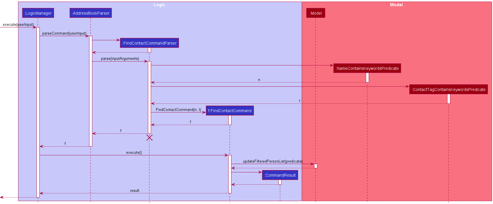
<div markdown="span" class="alert alert-info">:information_source: **Note:** The lifeline for `FindContactCommandParser` should end at the destroy marker (X) but due to a limitation of PlantUML, the lifeline reaches the end of diagram.
</div>
<div markdown="span" class="alert alert-info">:information_source: **Note:**The arguments for methods and constructors have been shortened for clarity in the diagram.
</div>

#### Activity Diagram

The activity diagram below shows the execution of the above example:

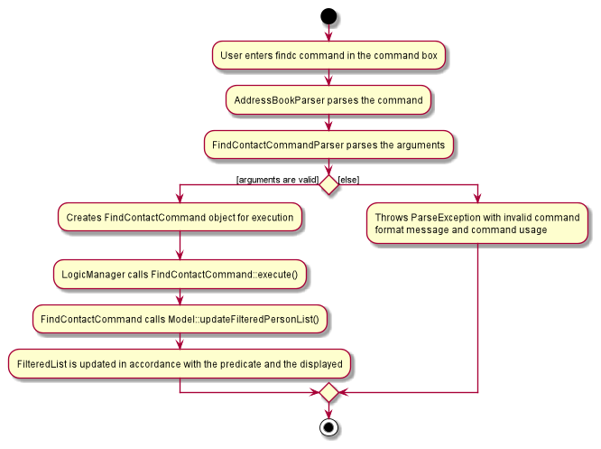

#### Design Considerations

**Aspect: How `names` and `tags` matches:**

* **Alternative 1 (current choice):** Only full names are matched
    * Pros: Filtered List will look less cluttered and allows users to easily look up a particular contact 
    * Cons: Users have less flexibility to search the contacts

* **Alternative 2:** Names that contain the input phrase is matched
  itself.
    * Pros: Users have more flexibility to search the contacts
    * Cons: The filtered list will be bloated and makes it difficult to look up a particular contact.
    

### Undo/redo feature

#### Implementation

The undo/redo mechanism is facilitated by `VersionedAddressBook`. It keeps track of AddressBook states, stored internally as an `addressBookStateList` and `currentStatePointer`. Additionally, it implements the following operations:

* `VersionedAddressBook#commit()` — Saves the current address book state in its history.
* `VersionedAddressBook#undo()` — Restores the previous address book state from its history.
* `VersionedAddressBook#redo()` — Restores a previously undone address book state from its history.
* `VersionedAddressBook#canUndo()` — Checks that `currentStatePointer` is not pointing to the first state in the `addressBookStateList`.
* `VersionedAddressBook#canRedo()` — Checks that `currentStatePointer` is not pointing to the last state in the `addressBookStateList`.

These operations are exposed in the `Model` interface as `Model#commitAddressBook()`, `Model#undoAddressBook()`, `Model#redoAddressBook()`, `Model#canUndo` and `Model#canRedo` respectively.

Given below is an example usage scenario and how the undo/redo mechanism behaves at each step.

Step 1. The user launches the application for the first time. The `VersionedAddressBook` will be initialized with the initial address book state, and the `currentStatePointer` pointing to that single address book state.


Step 2. The user executes `delete 5` command to delete the 5th person in the address book. The `delete` command calls `Model#commitAddressBook()`, causing the modified state of the address book after the `delete 5` command executes to be saved in the `addressBookStateList`, and the `currentStatePointer` is shifted to the newly inserted address book state.


Step 3. The user executes `add n/David …​` to add a new person. The `add` command also calls `Model#commitAddressBook()`, causing another modified address book state to be saved into the `addressBookStateList`.


<div markdown="span" class="alert alert-info">:information_source: **Note:** If a command fails its execution, it will not call `Model#commitAddressBook()`, so the address book state will not be saved into the `addressBookStateList`.

</div>

Step 4. The user now decides that adding the person was a mistake, and decides to undo that action by executing the `undo` command. The `undo` command will call `Model#undoAddressBook()`, which will shift the `currentStatePointer` once to the left, pointing it to the previous address book state, and restores the address book to that state.


<div markdown="span" class="alert alert-info">:information_source: **Note:** If the `currentStatePointer` is at index 0, pointing to the initial AddressBook state, then there are no previous AddressBook states to restore. The `undo` command uses `Model#canUndoAddressBook()` to check if this is the case. If so, it will return an error to the user rather
than attempting to perform the undo.

</div>

The following sequence diagram shows how the undo operation works:

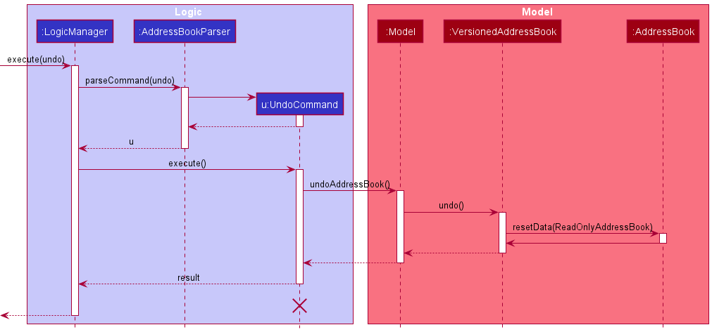

<div markdown="span" class="alert alert-info">:information_source: **Note:** The lifeline for `UndoCommand` should end at the destroy marker (X) but due to a limitation of PlantUML, the lifeline reaches the end of diagram.

</div>

The `redo` command does the opposite — it calls `Model#redoAddressBook()`, which shifts the `currentStatePointer` once to the right, pointing to the previously undone state, and restores the address book to that state.

<div markdown="span" class="alert alert-info">:information_source: **Note:** If the `currentStatePointer` is at index `addressBookStateList.size() - 1`, pointing to the latest address book state, then there are no undone AddressBook states to restore. The `redo` command uses `Model#canRedoAddressBook()` to check if this is the case. If so, it will return an error to the user rather than attempting to perform the redo.

</div>

Step 5. The user then decides to execute the command `list`. Commands that do not modify the address book, such as `list`, will usually not call `Model#commitAddressBook()`, `Model#undoAddressBook()` or `Model#redoAddressBook()`. Thus, the `addressBookStateList` remains unchanged.


Step 6. The user executes `clear`, which calls `Model#commitAddressBook()`. Since the `currentStatePointer` is not pointing at the end of the `addressBookStateList`, all address book states after the `currentStatePointer` will be purged. Reason: It no longer makes sense to redo the `add n/David …​` command. This is the behavior that most modern desktop applications follow.


The following activity diagram summarizes what happens when a user executes a new command:


#### Design considerations:

**Aspect: How undo & redo executes:**

* **Alternative 1 (current choice):** Saves the entire address book.
  * Pros: Easy to implement.
  * Cons: May have performance issues in terms of memory usage.

* **Alternative 2:** Individual command knows how to undo/redo by
  itself.
  * Pros: Will use less memory (e.g. for `delete`, just save the person being deleted).
  * Cons: We must ensure that the implementation of each individual command are correct.

### Managing meeting participants

#### Implementation

A `Meeting` object in AddresSoc has a set containing 0 or more participants, each represented by a
`Participant` object. Each `Participant` holds a reference to a `Contact` that exists in the
`UniquePersonList` of the `AddressBook`. This design is summarized below:

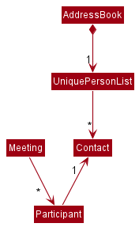

Users can directly modify the set of `Participants` of a `Meeting` during commands that allow them to specify
participant indexes, such as `AddMeetingCommand` and `EditMeetingCommand`. When entering these commands, the user optionally specifies the indexes of contacts in the
currently displayed contact list to participate in the meeting.  During such commands, the
general process of creating and adding `Participants` to a `Meeting`'s participant set is as follows:
1. If an index is specified, the validity of the index is checked.
    * If the index is invalid, the command execution is stopped.
    * If the index is valid, proceed to step 2.
2. The `Contact` specified by the index is obtained.
3. A `Participant` is created from the `Contact` and added to the `Meeting`'s participant set.
4. Repeat steps 1 to 3 for all indexes given by the user.

This process is summarised in the activity diagram below.

Activity: Create Participant

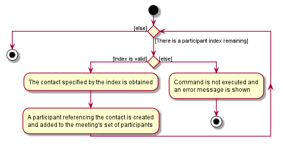

Another scenario when a `Meeting` may have its set of `Participants` modified is when a `Contact` object
is replaced by another `Contact` object in the `UniquePersonList` (ie. during the execution of `EditContactCommand`).
In this case, the `Participant` referencing the original `Contact` object is updated. Each `Meeting` that
this `Participant` participates in is replaced with a new `Meeting` containing the updated `Participant`.

It is important to note here that the **entire `UniqueMeetingList`** is looped through during this operation to check whether each `Meeting` is participated by this
`Participant`. The following activity diagram summarises this process:

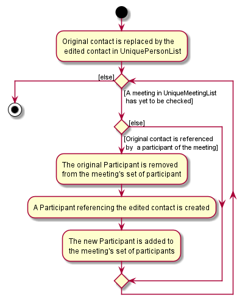

Similarly, the deletion of a `Contact` from `UniquePersonList` during the execution of `DeleteContactCommand` also
updates participant sets by looping through the entire `UniqueMeetingList`. The process is identical to the above,
except that no replacement participant is created and added to the meeting's participant set.

#### Design considerations:

**Aspect: Whether each `Contact` should keep track of a list of `Meetings` it participates in:**

* **Alternative 1 (current choice):** `Contacts` do not keep track of the `Meetings` they participate in.
    * Pros: More testable. The `Contact` class does not depend on `Meeting`, which reduces the
      chance of regressions.
    * Cons: Slower as every meeting in the `UniqueMeetingList` must be checked whenever a `Contact`
      is updated or deleted. The poor performance would be noticeable when there is a large number of meetings scheduled.

* **Alternative 2:** Each `Contact` keeps track of the `Meetings` it participates in.
    * Pros: When updating or deleting contacts, the meetings whose participant sets need to be updated
      can be directly accessed from the contact. Thus, these operations are faster.
    * Cons: Harder to implement. Moreover, the `Meeting` and `Contact` classes will now depend on each other. The cyclic dependency makes the code
      less testable.

Reasons for choosing Alternative 1:
* It reduces regressions by preventing cyclic dependencies.
* The number of meetings that the target user (a busy NUS School of Computing student) would realistically schedule is
  not expected to be so large that the slower performance of alternative 1 is noticeable.
* Hence, testability was prioritised over performance.

### \[Proposed\] Data archiving

_{Explain here how the data archiving feature will be implemented}_


### Reminder

This section describes how the reminder feature can be used for users to be reminded of meetings that will occur
within a certain time frame which the users can specify.

### Implementation

The reminder feature uses the `ReminderDatePredicate`.The condition to locate the meetings is provided through this.
The meetings in AddresSoc are extracted and stored in the `FilteredList`.
It is then used to update `FilteredList` using `FilteredList#setPredicate`.
The updated `FilteredList` is then displayed.
This operation uses the `Model` for `Model#UpdateFilteredMeetingList`.

Given below is an example usage scenario and how the Reminder mechanism behaves at each step.

1. The user keys in and executes the command `reminder 2` to locate all meetings within 2 days.
2. The command is parsed by `ReminderCommandParser`. The prefixes and their respective keywords are
    extracted and saved in an `ArgumentMultimap`. 
3. The inputs are then checked for their validity. If no exceptions are detected, a `ReminderDatePredicate` and a `ReminderCommand` will be created.

4. The `ReminderCommand#execute` is called which updates the `FilteredList` that is currently being displayed.

The following sequence diagram shows how this works:

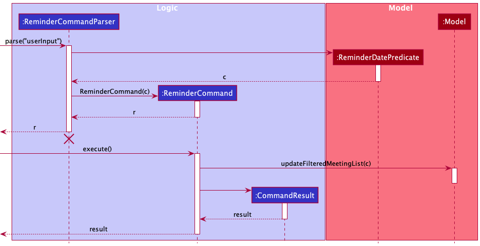

**Note:** The lifeline for `ReminderCommandParser` should end at the destroy marker (X) but due to a limitation of PlantUML,
the lifeline reaches the end of diagram.

#### Design considerations:

##### Aspect: How to allow users to receive reminders

* **Alternative 1 (current choice):** Create a `reminder` command that allows users to specify the number of days to
  return the result of upcoming meetings.
    * Pros:
        * Gives users flexibility in specifying the time frame they want to receive reminders for
        * Easy to implement.
    * Cons:
        * User has to manually specify number of days.

* **Alternative 2:** Set number of days reminders, so that when user call reminder command meetings 
upcoming in a fixed number of days will be displayed.
    * Pros:
        * User does not have to manually specify number of days since it is fixed.
    * Cons:
        * User has no flexibility to specify the time range to receive reminders for.
        


### Archive

#### 1. Archive

This section describes how the archive feature can be used to be archive meetings that users do not
want to appear in the meeting list , but still want to save the data. There is an unarchive command
which is used to revert the archive command.

### Implementation


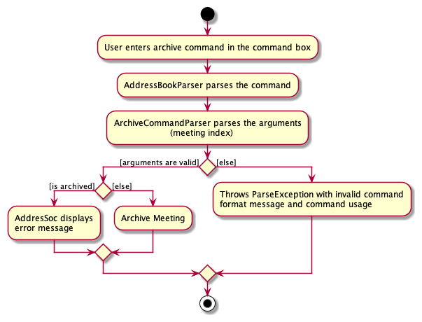

Users can archive a specific meeting by entering the `archive index` command. The following steps describe how this 
behaviour is implemented.

The archive feature uses the `ArchiveStatus`.The condition to is used to check whether the meeting
is already archived or not.
The meetings in AddresSoc are extracted and stored in the `FilteredList`.
It is then used to update `FilteredList` using `FilteredList#PREDICATE_SHOW_ALL_MEETINGS`.
The updated `FilteredList` is then displayed.
This operation uses the `Model` for `Model#UpdateFilteredMeetingList`.

The following sequence diagram shows how this works:

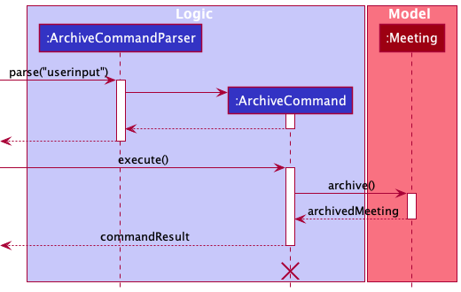

**Note:** The lifeline for `ArchiveCommandParser` should end at the destroy marker (X) but due to a limitation of PlantUML,
the lifeline reaches the end of diagram.


1. The user archives a `Meeting` in the observable `MeetingList` with command `archive index`.The index is parsed and
 archive command is executed.

2. The meeting's `ArchiveStatus` will be checked . If it is true, an error message will be displayed.

3. Otherwise the meeting's `ArchiveStatus` will be set to true by the `Meeting#archive()` method.

4. The current `FilteredList` will be updated showing only the unarchived meetings, facilitated by 
`Model#PREDICATE_SHOW_ALL_MEETINGS`

#### 2. Unarchive

This section shows how the archive feature can be reverted. The user can use the unarchive command so
that the unarchived meeting appear in the meeting list. 

### Implementation


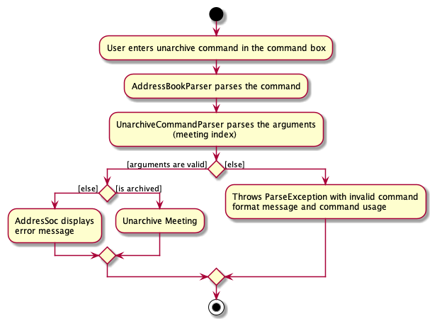

Users can unarchive a specific meeting by entering the `unarchive index` command. The following steps describe how this
behaviour is implemented.

The archive feature uses the `ArchiveStatus`.The condition to is used to check whether the meeting
is already archived or not.
The meetings in AddresSoc are extracted and stored in the `FilteredList`.
It is then used to update `FilteredList` using `FilteredList#PREDICATE_SHOW_ALL_MEETINGS`.
The updated `FilteredList` is then displayed.
This operation uses the `Model` for `Model#UpdateFilteredMeetingList`.


1. The user unarchives a `Meeting` in the observable `archivelist` with command `unarchive index`.The index is parsed and
   unarchive command is executed.

2. The meeting's `ArchiveStatus` will be checked . If it is false, an error message will be displayed.

3. Otherwise the meeting's `ArchiveStatus` will be set to false by the `Meeting#archive()` method.

4. The current `FilteredList` will be updated showing all the unarchived meetings, facilitated by
   `Model#PREDICATE_SHOW_ALL_MEETINGS`


--------------------------------------------------------------------------------------------------------------------

## **Documentation, logging, testing, configuration, dev-ops**

* [Documentation guide](Documentation.md)
* [Testing guide](Testing.md)
* [Logging guide](Logging.md)
* [Configuration guide](Configuration.md)
* [DevOps guide](DevOps.md)

--------------------------------------------------------------------------------------------------------------------

## **Appendix: Requirements**

### Product scope

**Target user profile**: [NUS School of Computing](https://www.comp.nus.edu.sg/) students who:

* have a need to manage a significant number of student contacts and meetings
* prefer desktop apps over other types
* can type fast and prefer typing to mouse interactions
* are reasonably comfortable using CLI apps

**Value proposition**: AddresSoC helps the student to
* keep track of the contacts of peers in the student's network,
* organize the contacts for easier lookup, and
* manage the student's social and academic life by keeping track of their schedule.

It completes these tasks faster than a typical mouse/GUI driven app.


### User stories

Priorities: High (must have) - `* * *`, Medium (nice to have) - `* *`, Low (unlikely to have) - `*`

| Priority | As a …​                                             | I can …​                                                  | So that …​                                                   |
| -------- | ------------------------------------------------------ | ------------------------------------------------------------ | --------------------------------------------------------------- |
| `* * *`  | user                                                   | add a contact                                                | I can look it up if I need to find the contact.                 |
| `* * *`  | user                                                   | delete a contact                                             | I can remove contacts I no longer need or had added wrongly.    |
| `* * *`  | user                                                   | view all my contacts                                         | I can see my full list of contacts at once.                     |
| `* * *`  | user                                                   | add a meeting                                                | I can look it up if I need to find the meeting.                 |
| `* * *`  | user                                                   | delete a meeting                                             | I can remove meetings that I had added wrongly or are already done.    |
| `* * *`  | user                                                   | view all my meetings                                         | I can see my full list of meetings at once.                     |
| `* * *`  | user who wants to contact a specific person            | view a single contact and its details                        |                                                                 |
| `* * *`  | user who needs to meet my peers                        | schedule a meeting with specific contacts in my contact list | I can keep track of my meetings                                 |
| `* *`    | careless user who keyed in wrong information for a contact | edit the contact                                        | I can correct the wrong information                             |
| `* *`    | careless user who keyed in wrong information for a meeting | edit the meeting                                        | I can correct the wrong information                             |
| `* *`    | careless user                                          | undo my previous action(s)                                   | I can correct mistakes I made (eg. recover a deleted meeting).  |
| `* *`    | user who wants to schedule meetings with various people| tag meetings with specific types (e.g. lunch, project)       | I can keep track of what each meeting is for.                   |
| `* *`    | user who has many contacts                             | add tags to each contact                                     | I can keep track of any notable information about the contact.  |
| `* *`    | user who wants to contact a specific person            | search for that specific contact                             | I do not need to look through the entire list to find it.       |
| `* *`    | user who wants to schedule a meeting on a specific day | search for meetings occurring that day                       | I can see what time I am free that day.                         |
| `* *`    | busy user with many meetings                           | search for meetings by name or tags                          | I can find specific meetings or groups of meetings easily.      |
| `* *`    | busy user with many meetings                           | be reminded of meetings happening in the next few days       | I do not forget these meetings.                                 |
| `* *`    | user who needs to manage a variety of contacts         | categorize my contacts into subgroups                        | I can keep track of what group each contact is from.            |
| `* *`    | user who needs to manage a variety of contacts         | search for contacts by their tags / grouping                 | I can find all contacts from a specific group / with a specific tag.            |
| `* *`    | user with many contacts in my contact list             | sort contacts by name                                        | I can locate a person easily.                                   |
| `* *`    | user with many meetings in my contact list             | sort meetings by date and time                               | I can see my earliest upcoming meetings.                        |
| `*`      | long-term user of the app                              | archive contacts that may no longer be relevant              | my contact list is less cluttered.                              |
| `*`      | user who wants to add many new contacts quickly        | add many contacts at once                                    | I do not have to spend time adding them individually.           |
| `*`      | new user who already has a contact list on another app | import all my contacts into AddresSoC                        | I do not have to spend time adding them individually.           |

*{More to be added}*

### Use cases

(For all use cases below, the **System** is the `AddresSoc` and the **Actor** is the `user`, unless specified otherwise)

**Use case: Add a contact**

**MSS**

1. User requests to add a new contact to the contact list
2. AddresSoc adds the contact

   Use case ends.

**Extensions**

* 2a. The contact list does not exist.

   * 2a1. AddresSoc creates a new list.

   Use case resumes at step 2.

* 3a. The contact specified by the user is invalid.

   * 3a1. AddresSoc shows an error message.

     Use case resumes at step 2.


**Use case: Delete a contact**

**MSS**

1.  User requests to list contacts
2.  AddresSoc shows a list of contacts
3.  User requests to delete a specific contact in the list
4.  AddresSoc deletes the contact

    Use case ends.

**Extensions**

* 2a. The list is empty.

  Use case ends.

* 3a. The contact specified by user is invalid.

    * 3a1. AddresSoc shows an error message.

      Use case resumes at step 2.

**Use case: Delete a meeting**

**MSS**

1.  User requests to list meetings
2.  AddresSoc shows a list of meetings
3.  User requests to delete a specific meeting in the list
4.  AddresSoc deletes the meeting

    Use case ends.

**Extensions**

* 2a. The list is empty.

  Use case ends.

* 3a. The specified meeting is invalid.

    * 3a1. AddresSoc shows an error message.

      Use case resumes at step 2.


**Use case: Add a meeting**

**MSS**

1.  User requests to list meetings
2.  AddresSoc shows a list of meetings
3.  User requests to add a meeting in the list
4.  AddresSoc deletes the person

    Use case ends.

**Extensions**

* 3a. The arguments passed are invalid.

    * 3a1. AddressBook shows an error message.

      Use case resumes at 2.

* 3b. The mandatory arguments are not passed.

    * 3b1. AddressBook shows an error message.

      Use case resumes at step 2.


*{More to be added}*

### Non-Functional Requirements

1.  Should work on any _mainstream OS_ as long as it has Java `11` or above installed.
2.  Should be able to hold up to 1000 persons without a noticeable sluggishness in performance for typical usage.
3.  A user with above average typing speed should be able to accomplish most of the tasks faster using commands than using the mouse.
4.  Should be easily maintainable and scalable (i.e. use of OOP and high cohesion) to implement new features in future.
5.  Should have high testability by reducing use of Coupling.
6.  Should be well documented for users to understand how to use the product.
7.  Should be well documented for developers to understand how to further improve the product.

*{More to be added}*

### Glossary

* **Mainstream OS**: Windows, Linux, Unix, OS-X

--------------------------------------------------------------------------------------------------------------------

## **Appendix: Instructions for manual testing**

Given below are instructions to test the app manually.

<div markdown="span" class="alert alert-info">:information_source: **Note:** These instructions only provide a starting point for testers to work on;
testers are expected to do more *exploratory* testing.

</div>

### Launch and shutdown

1. Initial launch

   1. Download the jar file and copy into an empty folder

   1. Double-click the jar file Expected: Shows the GUI with a set of sample contacts. The window size may not be optimum.

1. Saving window preferences

   1. Resize the window to an optimum size. Move the window to a different location. Close the window.

   1. Re-launch the app by double-clicking the jar file.<br>
       Expected: The most recent window size and location is retained.

1. _{ more test cases …​ }_

### Deleting a person

1. Deleting a person while all persons are being shown

   1. Prerequisites: List all persons using the `list` command. Multiple persons in the list.

   1. Test case: `delete 1`<br>
      Expected: First contact is deleted from the list. Details of the deleted contact shown in the status message. Timestamp in the status bar is updated.

   1. Test case: `delete 0`<br>
      Expected: No person is deleted. Error details shown in the status message. Status bar remains the same.

   1. Other incorrect delete commands to try: `delete`, `delete x`, `...` (where x is larger than the list size)<br>
      Expected: Similar to previous.

1. _{ more test cases …​ }_

### Adding a meeting

Prerequisites: Default list of meetings are loaded into the application.

1. Test case: `addm n/Lunch with Friends d/30-04-2022 st/1100 et/1300 t/important` <br>
Expected: New meeting is added to the list. Details of added meeting is shown in status message.

2. Test case: `addm n/Project Meeting with Advisor d/30-04-2022 st/1200 et/1400` <br>
Expected: New meeting is added to the list. Warning notification pop up due to clash in timing with previously added
meeting. Details of added meeting and meeting it clashes with is shown in status message.

3. Test case: `addm n/Project Meeting with Advisor d/30-04-2022 st/1600 et/1800` <br>
Expected: No meeting is added due to duplicate meeting with meeting added in previous test case. Error details shown in the status message.

Other incorrect `addm` commands to try: `addm n/Dinner with Family d/24-05-2022`, `addm n/2103 Exam d/23-04-2022 st/1500 et/1400`, `addm`

### Deleting a meeting

Deleting a meeting while all meetings are being shown

Prerequisites: List all meetings using the `listm` command. Multiple meetings in the list.

1. Test case: `deletem 1` <br>
Expected: First meeting is deleted from the list. Details of the deleted meeting is shown in the status message.

2. Test case: `deletem 0` <br>
Expected: No meeting is deleted. Error details shown in the status message.

Other incorrect `deletem` commands to try: `deletem`, `deletem x`, (where x is larger than the list size)<br>
Expected: Similar to previous.

### Undo/Redo

Prerequisites: No contacts sharing any of the fields with contact to be added in test case.

1. Test case: `addc n/Bobby Tan p/98127492 e/Bobby01@gmail.com th/Bobby012` followed by `undo` <br>
Expected: Contact will first be added to the list and details of the added contact is shown in the status message.
The contact will be removed after `undo` is executed and a successful `undo` message is shown.

2. Test case: `addc n/Bobby Tan p/98127492 e/Bobby01@gmail.com th/Bobby012` followed by `undo`, then `redo` <br>
Expected: Similar to previous test case. However, contact will be added back to the list after execution of
`redo`, and a successful `redo` message is shown.

3. Test case: `undo` without any prior changes to the lists <br>
Expected: No change to the lists. Error details are shown in the status message.

4. Test case: `redo` without any prior `undo` command <br>
Expected: No change to the lists. Error details are shown in the status message.

### Archiving a meeting

1. Archiving a meeting while all meetings are being shown

    1. Prerequisites: List all meetings using the `listm` command. Multiple meetings in the list.

    2. Test case: `archive 1`<br>
       Expected: First meeting is archived from the list. Details of the archived contact shown in the status message. 

    3. Test case: `archive 0`<br>
       Expected: No meeting is archived. Error details shown in the status message. Status bar remains the same.

    4. Other incorrect archive commands to try: `archive`, `archive x`, `...` (where x is larger than the list size)<br>
       Expected: Similar to previous.

### Unarchiving a meeting

1. Unarchiving a meeting while all archived meetings are being shown

    1. Prerequisites: List all archived meetings using the `archivelist` command. Multiple meetings in the list.

    1. Test case: `unarchive 1`<br>
       Expected: First meeting is archived from the list. Details of the archived contact shown in the status message.

    1. Test case: `unarchive 0`<br>
       Expected: No meeting is archived. Error details shown in the status message. Status bar remains the same.

    1. Other incorrect archive commands to try: `unarchive`, `unarchive x`, `...` (where x is larger than the list size)<br>
       Expected: Similar to previous.
   
### 
### Saving data

1. Dealing with missing/corrupted data files

   1. _{explain how to simulate a missing/corrupted file, and the expected behavior}_

1. _{ more test cases …​ }_
