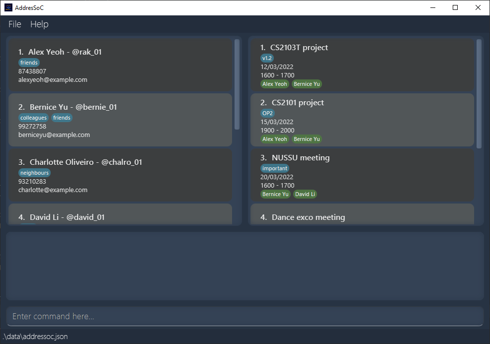
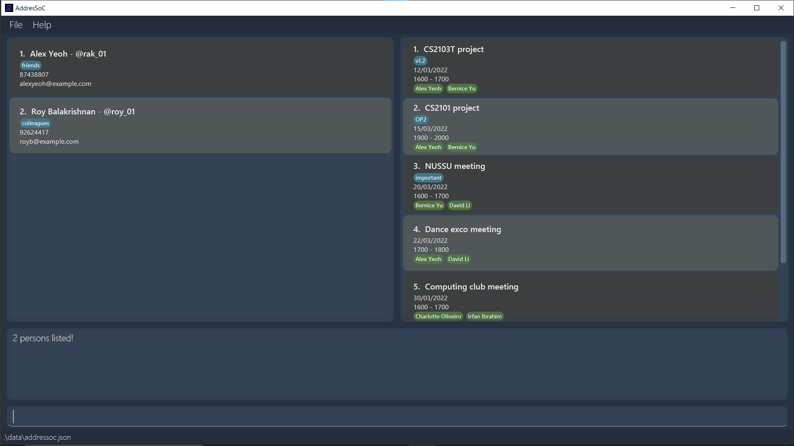
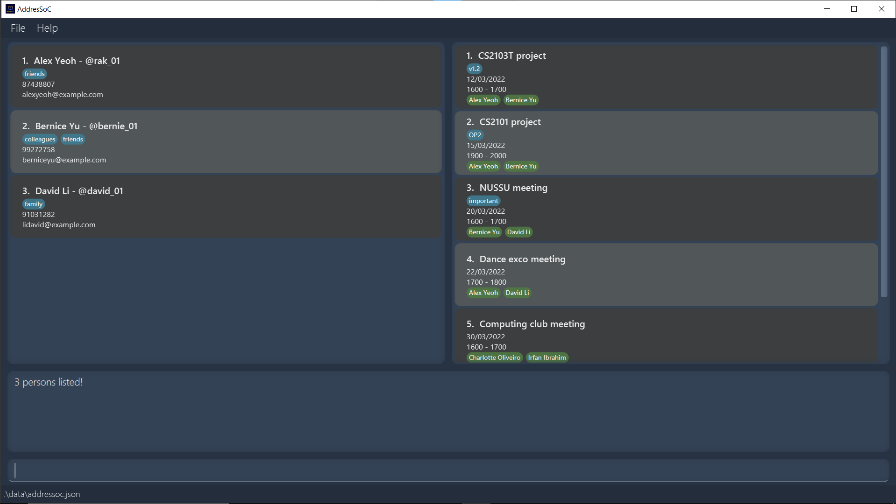
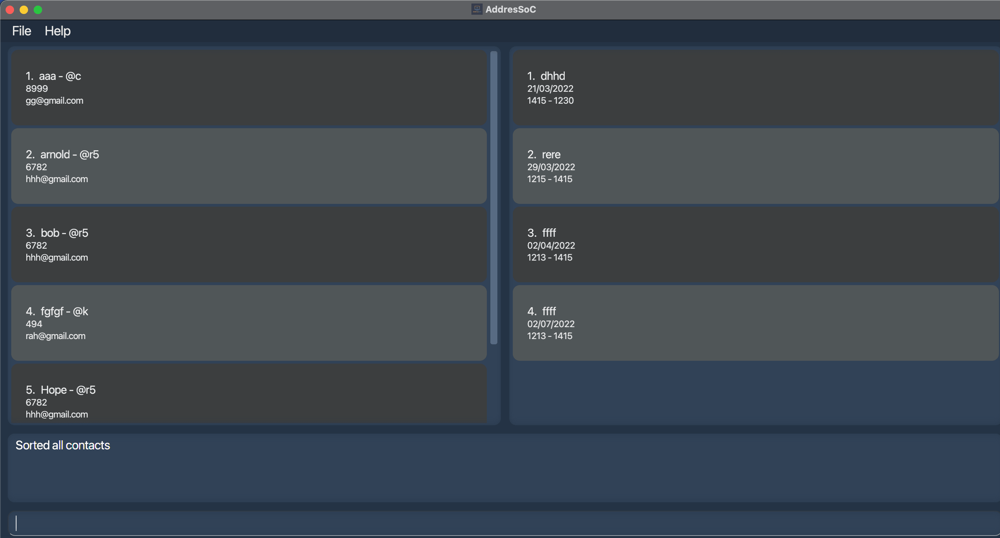
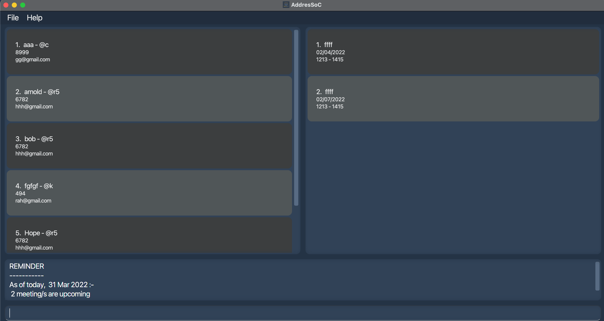
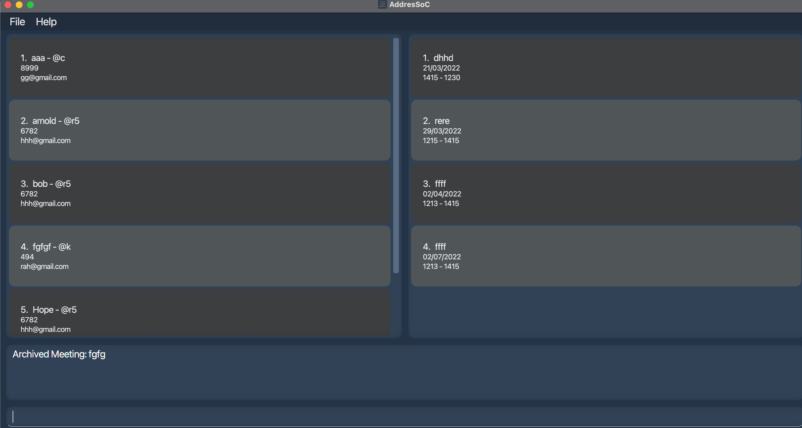
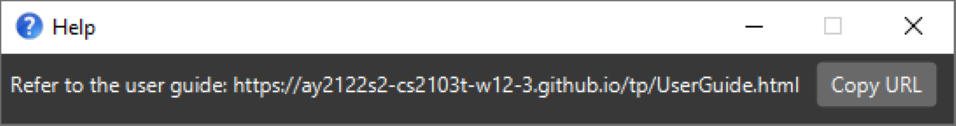

AddresSoC is a desktop app for School of Computing (SoC) students to **keep track of their student network and add meetings**.
It is optimized for use via a Command Line Interface (CLI) while still having the benefits of a Graphical User Interface (GUI).
If you're a student who can type fast, AddresSoC can get your contact and schedule management tasks done faster than traditional GUI apps.

* Table of Contents
{:toc}

--------------------------------------------------------------------------------------------------------------------

# Quick start

1. Ensure you have Java `11` or above installed in your Computer.

2. Download the latest `addressoc.jar` from [here](https://github.com/AY2122S2-CS2103T-W12-3/tp/releases/latest).

3. Copy the file to the folder you want to use as the _home folder_ for your AddresSoC.

4. Double-click the file to start the app. The GUI similar to the one below should appear in a few seconds. Note how the app contains some sample data. 
   

5. Type the command in the command box and press Enter to execute it. e.g. typing **`help`** and pressing Enter will open the help window. 
   Some example commands you can try:

   * **`listc`** : Lists all your contacts.

   * **`addc`**` n/John Doe e/johnd@u.nus.edu p/98076034 th/johnd` : Adds a contact named `John Doe` to your contact list.

   * **`addm`**` n/SE Team Meeting d/23/03/2022 st/1415 et/1615` : Adds a meeting called "SE Team Meeting" on 23 March 2022 from 1415hrs to 1615hrs.

   * **`deletec`**`3` : Deletes the 3rd contact shown in your currently displayed contact list.

   * **`clear`** : Deletes all your contacts and meetings.

   * **`exit`** : Exits the app.

6. You may refer to the [Features](#features) below for details of each command.

--------------------------------------------------------------------------------------------------------------------

# Features

**:information_source: Notes about the command format:** 

* Words in `UPPER_CASE` are the parameters to be supplied by you. 
  e.g. in `addc n/NAME`, `NAME` is a parameter which can be used as `addc n/John Doe`.

* Items in square brackets are optional. 
  e.g.  `n/NAME [t/TAG]` can be used as `n/John Doe t/friend` or as `n/John Doe`.

* Items with `…`​ after them can be used multiple times including zero times. 
  e.g. `[t/TAG]…​` can be used as ` ` (i.e. 0 times), `t/friend`, `t/friend t/family` etc.

* Parameters can be in any order. 
  e.g. if the command specifies `n/NAME p/PHONE_NUMBER`, `p/PHONE_NUMBER n/NAME` is also acceptable.

* If a parameter is expected only once in the command but you specified it multiple times, only the last occurrence of the parameter will be taken. 
  e.g. if you specify `p/12341234 p/56785678`, only `p/56785678` will be taken.

* Extraneous parameters for commands that do not take in parameters (such as `listc`, `listm`, `help`, `exit` and `clear`) will be ignored. 
  e.g. if the command specifies `help 123`, it will be interpreted as `help`.

## Contact

### Listing all contacts : `listc`

Shows you all the contacts in your contact list.

Format: `listc`

### Adding a contact : `addc`

Adds the specified contact to your contact list.

Format: `addc n/NAME e/EMAIL p/PHONE_NUMBER th/TELEGRAM_HANDLE [t/TAGS]...`

* Adds a person into your contact list with given email, phone number, telegram handle.
* Optionally Tags can also be specified
* A maximum of 9 tags can be added

Examples:
* `addc n/Alice Lee e/alice.lee@u.nus.edu p/786454454 th/theor9 t/database expert t/CS2103 teammate` adds the contact Alice Lee with the given email, phone, telegram and tags
* `addc n/Bob Tan p/91234567` gives an error message as e/EMAIL and th/TELEGRAM is not optional

### Deleting a contact : `deletec`

Removes the specified person from your currently displayed contact list.

Format: `deletec CONTACT_INDEX`

* Deletes the contact at the specified CONTACT_INDEX.
* CONTACT_INDEX refers to the index number shown in your currently displayed contact list.
* The index **must be a positive integer** 1, 2, 3, …​

Examples:
* `deletec 2` deletes the 2nd person in your currently displayed contact list.
* `deletec 0` returns an error for invalid input as 0 is not a positive integer.

### Editing a contact : `editc`

Edits an existing contact in your currently displayed contact list.

Format: `editc CONTACT_INDEX [n/NAME] [p/PHONE] [e/EMAIL] [th/TELEGRAM_HANDLE] [t/TAG]…​`

* Edits the contact at the specified `CONTACT_INDEX`. 
* `CONTACT_INDEX` refers to the index number shown in your currently displayed contact list. 
* `CONTACT_INDEX` **must be a positive integer** 1, 2, 3, …​
* At least one of the optional fields must be provided.
* Existing contact details will be updated according to your input fields.

:bulb: **Tip:**
When editing tags, the existing tags of the contact will be removed i.e adding of tags is not cumulative. You can remove all the person’s tags by typing `t/` without specifying any tags after it.

Examples:
* `editc 1 p/91234567 e/johndoe@example.com` Edits the phone number and email address of the 1st contact to be `91234567` and `johndoe@example.com` respectively.
* `editc 2 n/Betsy Crower t/` Edits the name of the 2nd contact to be `Betsy Crower` and clears all existing tags.

### Locating contacts by name and tag: `findc`

Finds the contacts that match your search criteria as explained below:

Format: `findc [n/NAMES]... [t/TAGS]...`

* For both `NAMES` and `TAGS`:
    * The search is case-insensitive e.g. `t/friends` matches `Friends`
    * Only full words are matched e.g. `n/alex` matches `Alex Yeoh` but not `Alexander Yeoh`
* If you specify only `n/NAMES`, contacts matching at least one of `n/NAMES` will be returned.
* If you specify only `t/TAGS`, contacts matching at least one of `t/TAGS` will be returned.
* If you specify both `n/NAMES` and `t/TAGS`, contacts matching at least one of `n/NAMES`
  and at least one of `t/TAGS` will be returned.

Examples:
* `findc n/alex n/roy` returns the contacts named `alex` or `roy`
  
* `findc t/friends t/family` returns the contacts matching the `friends` tag or the `family` tag or both 
  
* `findc n/alex t/friends` returns `Alex Yeoh` if the Contact contains `friends` tag
* `findc n/Alex n/David t/family t/friends` will return `Hans Gruber`, `Bo Yang` if both Contacts contain either
  the `family` tag or the `friends` tag or both.
  
  

### Sorting contacts : `sortc`

Sort contacts in the displayed contact list according to name.

Format: `sortc`

* Sort contacts according to name.

## Meeting

### Listing all meetings : `listm`

Shows you a list of all meetings in your meeting list.

Format: `listm`

### Adding a meeting : `addm`

Adds a meeting to your meeting list.

Format: `addm n/NAME d/DATE st/START_TIME et/END_TIME [pt/CONTACT_INDEX]... [t/TAGS]...`

* Adds a meeting with a specified date, start time and end time to your meeting list.
* `DATE` requires the format **DD/MM/YYYY** or **DD-MM-YYYY** e.g. 20/02/2022 or 20-02-2022.
* `START_TIME` and `END_TIME` requires the format **hhmm** e.g. 2359.
* `START_TIME` needs to be earlier than `END_TIME`.
* Optionally, the contacts involved in the meeting can also be specified by a `CONTACT_INDEX`.
* `CONTACT_INDEX` refers to the index number shown in your currently displayed contact list.
* `CONTACT_INDEX` **must be a positive integer** 1, 2, 3, …​

**:information_source: Note:** The app will notify you in case of any clash in meeting timings upon adding a meeting.

Examples:
* `addm n/CS2103 Project Discussion d/23-02-2022 st/1800 et/1930 pt/1 pt/2 pt/3 pt/4 pt/5`
  Adds the meeting "CS2103 Project Discussion" with your given date, time and participants.
* `addm n/JAVA Workshop d/23-02-2022 st/1030 et/1230`
  Adds meeting "JAVA Workshop" with your given date and time.
* `addm n/Job Interview st/1500 et/1700`
  Returns error message as d/DATE is missing.
* `addm n/CS2102 Project Discussion d/25/03/2022 st/1500 et/1400`
  Returns error message as your end time input `et/1400` is earlier than your start time input `st/1500`.

### Deleting a meeting : `deletem`

Deletes the specified meeting from your currently displayed meeting list.

Format: `deletem MEETING_INDEX`

* Deletes the meeting at the specified `MEETING_INDEX`.
* `MEETING_INDEX` refers to the index number shown in your currently displayed meetings list.
* `MEETING_INDEX` **must be a positive integer** 1, 2, 3, …​

Examples:
* `deletem 3` deletes the 3rd meeting in your currently displayed meeting list.
* `deletem -1` returns an error for invalid input as -1 is not a positive integer.

### Editing a meeting : `editm`

Edits an existing meeting in your currently displayed meeting list.

Format: `editm MEETING_INDEX [n/NAME] [d/DATE] [st/START_TIME] [et/END_TIME] [pt/PARTICIPANTS_INDEX]... [t/TAGS]...`

* Edits the meeting at the specified `MEETING_INDEX`.
* `MEETING_INDEX` refers to the index number shown in your currently displayed meeting list.
* `MEETING_INDEX` **must be a positive integer** 1, 2, 3, …​
* At least one of the optional fields must be provided.
* Existing meeting details will be updated according to your input fields.

:bulb: **Tip:**
When editing participants and tags, the existing participants and tags of the contact will be removed i.e.
adding of participants and tags is not cumulative. You can remove all the meeting’s participants and tags by typing
`pt/` `t/` without specifying any participants and tags after it respectively.

Examples:
* `editm 1 n/cs2103 project et/1930` Edits the meeting name and end time of the 1st meeting to be `cs2103 project` and  `1930` respectively.
* `editm 2 pt/ t/` Clears all existing participants and all existing tags of the 2nd meeting.

### Locating meetings by date, name and tag: `findm`

Finds meetings that match your search criteria as explained below:

Format: `findm [d/DATES]... [n/NAMES]... [t/TAGS]...`
* If you specify only `d/DATES`, meetings occurring on any of the `DATES` will be returned.
  Note that the `DATES` must be specified in either the **DD-MM-YYYY** or **DD/MM/YYYY** format
* If you specify only `n/NAMES`, meetings matching at least one of `n/NAME` will be returned.
* If you specify only `t/TAGS`, meetings matching at least one of `t/TAGS` will be returned.
* For `NAMES` and `TAGS`: 
    * The search is case-insensitive e.g. `t/planning` matches `Planning`
    * Only full words are matched e.g. `n/proj` matches `proj meeting` but not `project meeting`
* If you specify more than one type of input, meetings matching at least **one of each type** will be returned. 
  
  eg. If you specify both `n/NAMES` and `t/TAGS`, meetings matching at least one of `NAMES`
  **and** at least one of `TAGS` will be returned.

Examples:
* `findc n/event n/project` returns meetings titled `Event`, `event planning`, `Project Meeting`, etc.
* `findc n/event d/18-06-2022 t/important` returns a meeting that occurs on `18-06-2022`, is named `event planning` 
  **and** has a tag called `important`
* `findc n/event n/project d/01-06-2022` returns meetings that occur on `01-06-2022` and are named `event planning` or  `project`, etc.

### Sorting meetings : `sortm`

Sorts meetings in the displayed meeting list according to date and time.

Format: `sortm`

* Sorts meeting according to date
* Meetings on same day are sorted according to time

### Reminder : `reminder`

Format: `reminder NUM_OF_DAYS`

Reminds you of meetings that occur within the given number of days

Examples:
* `Reminder 2` lists meetings that occur within 2 days
* `Reminder 100` lists meetings that occur within 100 days

### Archive : `archive`

Format: `archive MEETING_INDEX`

Archives the meeting specified by the meeting index

Examples:
* `archive 2` archives 2nd meeting in the displayed meeting list
* `archive 10` archives 10th meeting in the displayed meeting list

### Unarchive : `unarchive`

Format: `unarchive MEETING_INDEX`

Unarchives the meeting specified by the meeting index

Examples:
* `unarchive 2` archives 2nd meeting in the archive meeting list
* `unarchive 5` archives 5th meeting in the archive meeting list

### Archive list : `archivelist`

Format: `archivelist`

Lists the archived meetings.

## Common

### Clearing all entries : `clear`

Clears all your contacts and meetings from AddresSoC.

Format: `clear`

### Undoing a change : `undo`

You can use the `undo` command to revert a change to your meeting or contact lists.

Format: `undo`

Examples:
* `undo` after `addc n/Alice Lee e/alice.lee@u.nus.edu p/786454454 th/theor9` 
removes the added contact from your contact list.
* `undo` after `deletem 3` restores the Meeting that was deleted.
* `undo` after `findc t/family` will not revert the filtering of the contact list as
`findc` does not change your contact list.

:bulb: **Tip:**
If you would like to revert a `findc` command, you may use `listc` to return to the full contact list.

### Redoing an undo : `redo`

You can use the `redo` command to revert an `undo` command.

Format: `redo`

Examples:
* `redo` after an `undo` that reverts a `deletem 3` command will delete the meeting restored by `undo`.

### Viewing help : `help`

Shows you a message explaining how to access the help page.

Format: `help`

### Exiting the program : `exit`

Exits the program.

Format: `exit`

### Saving the data

AddresSoC data (both your contact list and meeting list) is saved in your hard disk automatically after
any command that changes the data. There is no need for you to save manually.

### Editing the data file

If you are an advanced user, you are welcome to update data directly by editing the JSON file where the data is saved. To do so, navigate to the
folder containing the `addressoc.jar` file to find a folder called `data`. Access the folder and edit the `addressoc.json` file found inside.

:exclamation: **Caution:**
If your changes to the data file makes its format invalid, AddressSoC will discard all data and start with an empty data file the next time you run the app.

--------------------------------------------------------------------------------------------------------------------

## FAQ

**Q**: How do I transfer my data to another Computer? 
**A**: When you install the app in the other computer, you may overwrite the empty data file it creates with the file that contains the data of your previous AddresSoc home folder.

--------------------------------------------------------------------------------------------------------------------

## Command summary

Action | Format, Examples
--------|------------------
**List contacts** | `listc`
**Add contact** | `addc n/NAME e/EMAIL p/PHONE_NUMBER th/TELEGRAM_HANDLE [t/TAGS]...`   e.g., `addc n/Alice Lee e/alice.lee@u.nus.edu p/76054673 th/alicey76 t/database expert t/CS2103 teammate`
**Delete contact** | `deletec CONTACT_INDEX`   e.g., `deletec 2`
**Edit contact** | `editc CONTACT_INDEX [n/NAME] [p/PHONE_NUMBER] [e/EMAIL] [th/TELEGRAM_HANDLE] [t/TAG]…​`  e.g.,`editc 2 n/James Lee e/jameslee@example.com`
**Find contact** | `findc [n/NAME]... [t/TAGS]...`  e.g., `findc n/James n/Jake`
**List meetings** | `listm`
**Add meeting** | `addm n/NAME d/DATE st/START_TIME et/END_TIME [pt/PARTICPANTS_INDEX]... [t/TAGS]...`  e.g., `addm n/CS2103 Project Discussion d/20/02/2022 st/1800 et/1930 pt/1 pt/2 pt/3`
**Delete meeting** | `deletem MEETING_INDEX`  e.g., `deletem 2`
**Edit meeting** | `editm MEETING_INDEX [n/NAME] [d/DATE] [st/START_TIME] [et/END_TIME] [pt/PARTICIPANTS_INDEX]... [t/TAGS]...`  e.g., `editm 1 et/1930 pt/1 pt/2 pt/3`
**Find meeting** | `findm [d/DATES]... [n/NAMES]... [t/TAGS]...`  e.g., `findm n/project n/event d/18-06-2022`
**Clear** | `clear`
**Undo** | `undo`
**Redo** | `redo`
**Help** | `help`
